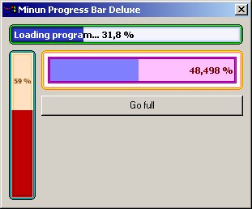



## Minun Progress Bar Deluxe 0\.9

### Description

This is a new cool progress bar control. I've been doing it two days, based partly on my previos progress bar (I submitted it now already as I'm doing my military service and are therefore limited in time). Though this one is different by looks and is also improved by speed.

At the moment the control is not complete, there are properties that are not yet finished. Despite this fact, the control does work. I wish you like that control and that it's customizable :) You can change borders' style, all the colors (15 different), direction (right, up, left, down), set text on it, custom done text and so on.
 
### More Info
 
Control is done with VB5CCE, example program with VB6. You cannot use Windows' colors at the moment. The code is slightly commented, but leaves a lot of thinking for the reader.

             |
---                |---
**Submitted On**   |2003-03-09 11:24:04
**By**             |[Vesa Piittinen](https://github.com/Planet-Source-Code/PSCIndex/blob/master/ByAuthor/vesa-piittinen.md)
**Level**          |Intermediate
**User Rating**    |5.0 (15 globes from 3 users)
**Compatibility**  |VB 5\.0, VB 6\.0
**Category**       |[Custom Controls/ Forms/  Menus](https://github.com/Planet-Source-Code/PSCIndex/blob/master/ByCategory/custom-controls-forms-menus__1-4.md)
**World**          |[Visual Basic](https://github.com/Planet-Source-Code/PSCIndex/blob/master/ByWorld/visual-basic.md)
**Archive File**   |[Minun\_Prog155696392003\.zip](https://github.com/Planet-Source-Code/vesa-piittinen-minun-progress-bar-deluxe-0-9__1-43875/archive/master.zip)

